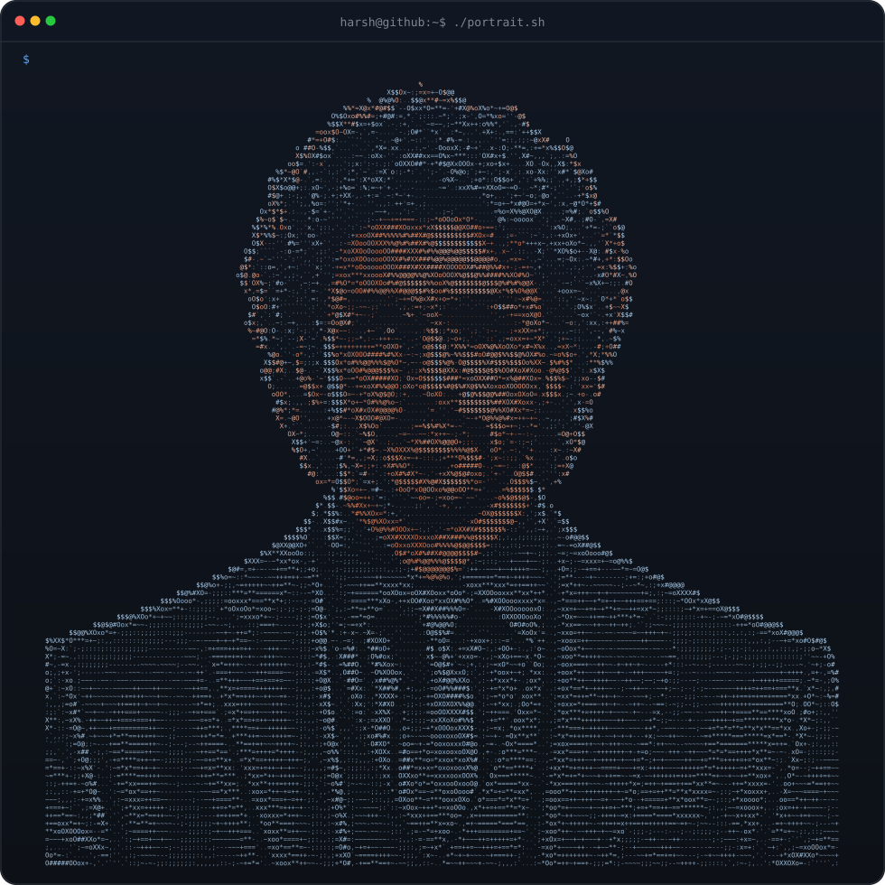

<!-- ═══════════════════════════ HERO ═══════════════════════════ -->

<div align="center">
  

  <a href="https://git.io/typing-svg">
    
  </a>

  <br><br>

  <a href="https://ueux.github.io/" target="_blank">
    
  </a>
  <a href="https://github.com/ueux/ueux/raw/main/MyResume (2).pdf" download>
    
  </a>

  <br><br>

  
  
  
  
  
  
  
</div>

<br>

<!-- ═══════════════════════════ WHOAMI ═══════════════════════════
     ascii portrait (left) + neofetch-style card (right)
     portrait file: harsh-github-portrait-ascii.svg (980x980, commit it to the repo root) -->

<h3 align="center"><code>harsh@github ~ $ whoami</code></h3>

<div align="center">
<table>
<tr>
<td valign="top"></td>
<td valign="middle">

```text
harsh@github
────────────────────────────────────────
Role       Software Engineer
           AI Developer
Focus      LLMs · ML · CV · AI Agents
Stack      React · Next.js · Node.js
           Express · TypeScript · Python
Databases  MongoDB · PostgreSQL
Exploring  Robotics · Automation · HRI
Education  B.Tech CSE @ RIT (2023–27)
Wins       1st place · RIT-A-THON
Mission    Bridge software, AI & robotics
```

</td>
</tr>
</table>
</div>

<p align="center">
  I build <b>intelligent systems and impactful digital products</b> — from full-stack web platforms to machine learning, computer vision and robotics — combining creativity with engineering to solve real-world problems.
</p>

<p align="center"><i>"To create innovative technologies that bridge the gap between software, AI, and robotics."</i></p>

---

<!-- ═══════════════════════════ STACK ═══════════════════════════ -->

<h3 align="center"><code>harsh@github ~ $ ./stack.sh</code></h3>

<div align="center">
<table>
<tr>
  <td align="right"><b>Languages</b></td>
  <td></td>
</tr>
<tr>
  <td align="right"><b>Frontend</b></td>
  <td></td>
</tr>
<tr>
  <td align="right"><b>Backend &amp; Data</b></td>
  <td></td>
</tr>
<tr>
  <td align="right"><b>AI / ML</b></td>
  <td>
    <br>
    
    
    
  </td>
</tr>
<tr>
  <td align="right"><b>Cloud &amp; Tools</b></td>
  <td></td>
</tr>
<tr>
  <td align="right"><b>Data &amp; Notebooks</b></td>
  <td>
    
    
    
  </td>
</tr>
</table>
</div>

---

<!-- ═══════════════════════════ CONTRIBUTIONS ═══════════════════════════ -->

<h3 align="center"><code>harsh@github ~ $ ./contributions.sh</code></h3>

<div align="center">
<picture>
  <source media="(prefers-color-scheme: dark)"
    srcset="https://raw.githubusercontent.com/ueux/ueux/output/github-contribution-grid-snake-dark.svg">
  <source media="(prefers-color-scheme: light)"
    srcset="https://raw.githubusercontent.com/ueux/ueux/output/github-contribution-grid-snake.svg">
  
</picture>
<br>

</div>

<br>

<!-- ═══════════════════════════ STATS ═══════════════════════════ -->

<h3 align="center"><code>harsh@github ~ $ ./stats.sh</code></h3>

<div align="center">
<table>
<tr>
  <td valign="top"></td>
  <td valign="top"></td>
</tr>
</table>

</div>

---

<!-- ═══════════════════════════ PROJECTS ═══════════════════════════ -->

<h3 align="center"><code>harsh@github ~ $ ls projects/</code></h3>

<div align="center">
  <a href="https://github.com/ueux/ULOGS">
    
  </a>
  <a href="https://github.com/ueux/UTube">
    
  </a>
</div>

<br>

---

<!-- ═══════════════════════════ CODING STATS ═══════════════════════════ -->

<h3 align="center"><code>harsh@github ~ $ ./coding-stats.sh</code></h3>

<div align="center">
  <a href="https://leetcode.com/ueu_x" target="_blank">
    
  </a>
  <a href="https://www.geeksforgeeks.org/user/harshkumadc31/" target="_blank">
    
  </a>
  <br>
  
</div>

---

<!-- ═══════════════════════════ CONTACT ═══════════════════════════ -->

<h3 align="center"><code>harsh@github ~ $ ./contact.sh</code></h3>

<p align="center"><i>Open to ideas, collaborations and interesting problems — say hi.</i></p>

<p align="center">
  <a href="mailto:hemenderkumar3000@gmail.com" target="_blank">
    
  </a>
  <a href="https://www.linkedin.com/in/harsh-kumar-ueux/" target="_blank">
    
  </a>
  <a href="https://www.kaggle.com/ueux404" target="_blank">
    
  </a>
  <a href="https://www.instagram.com/_harsh_6_1" target="_blank">
    
  </a>
  <a href="https://github.com/ueux" target="_blank">
    
  </a>
  <a href="https://leetcode.com/ueu_x" target="_blank">
    
  </a>
</p>

<p align="center">
  
</p>
